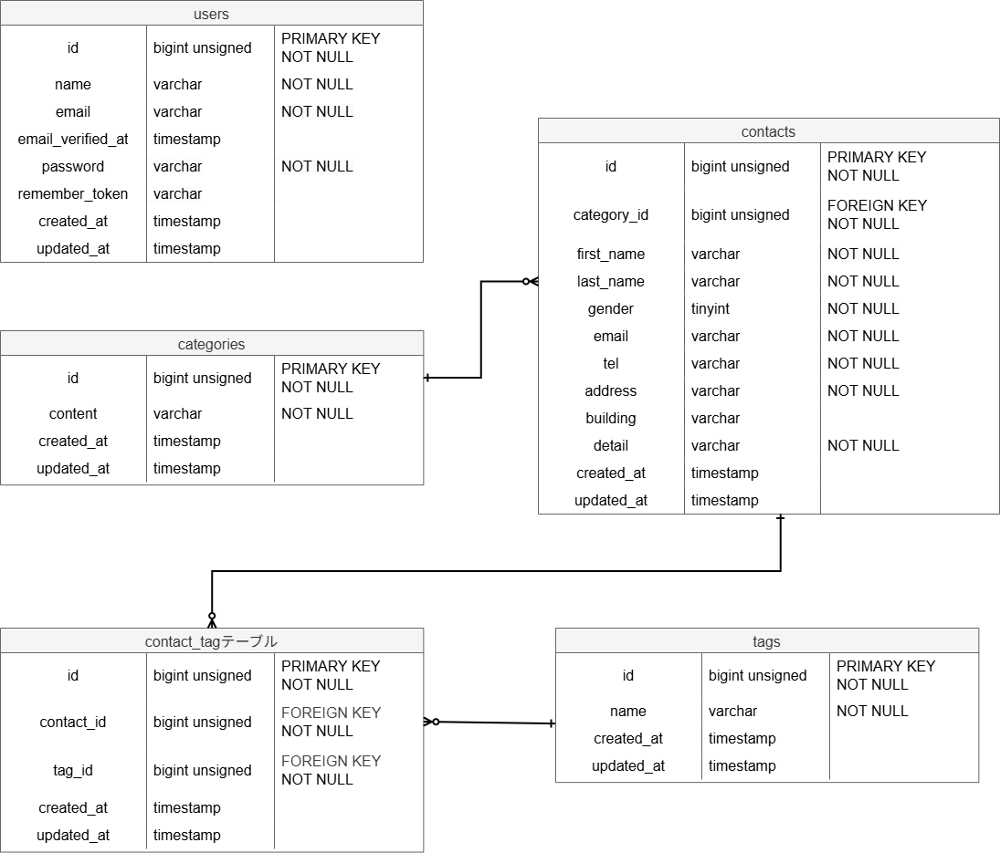

# COACHTECH お問い合わせフォーム

## 概要

本プロジェクトは、基礎学習ターム 確認テストとして作成した、お問い合わせフォームアプリケーションです。確認テストを通して現在、自分が不足・苦手としている分野を洗い出し、復習することを目的として作成しています。
一般ユーザーは公開のお問い合わせフォームから問い合わせを送信でき、管理者はログイン後、管理画面で問い合わせ内容の検索・詳細確認・削除、およびタグの管理を行うことができます。

### 実装した機能

**基本機能**

- お問い合わせフォーム（入力・確認・送信・サンクスページ）
- 管理者登録・ログイン機能
- 管理画面（お問い合わせ一覧・キーワード/性別/カテゴリ/日付検索・ページネーション・詳細表示・削除）
- タグ管理機能（一覧・追加・編集・削除）

**応用機能**

- お問い合わせデータに対する公開API

## ER図



### テーブル関連

- `categories` 1 - 多 `contacts`
- `contacts` 1 - 多 `contact_tag`
- `tags` 1 - 多 `contact_tag`
- （`contacts` と `tags` は `contact_tag` を中間テーブルとした多対多の関係）

## 環境構築手順

### 前提

- Docker / Docker Compose がインストールされていること

### 手順

1. リポジトリをクローンする

```bash
git clone https://github.com/shiningsword20/contact-form-app.git
cd contact-form-app
```

2. `.env` ファイルを作成し、環境に応じて設定する

```bash
cp .env.example .env
```

`.env` 内のDB接続情報が、以下になっていることを確認してください（Sail標準のデフォルト値です）。

```
DB_CONNECTION=mysql
DB_HOST=mysql
DB_PORT=3306
DB_DATABASE=laravel
DB_USERNAME=sail
DB_PASSWORD=password
```

3. Composerの依存パッケージをインストールする

```bash
composer install
```

4. Sailを起動する

```bash
./vendor/bin/sail up -d
```

5. アプリケーションキーを生成する

```bash
sail artisan key:generate
```

6. マイグレーション・シーディングを実行する

```bash
sail artisan migrate --seed
```

### シーディングによって作成される管理者アカウント（開発環境のみ）

開発環境の動作確認用として、以下のアカウントがシーディングにより自動作成されます。

| 項目           | 値               |
| -------------- | ---------------- |
| メールアドレス | test@example.com |
| パスワード     | password         |

7. CSSやJavaScriptを画面で使える状態にする

```bash
sail npm install
sail npm run dev
```

8. ブラウザで以下にアクセスする

```
http://localhost
```

## テストの実行

```bash
sail test
```

カバレッジレポートを確認する場合：

```bash
sail test --coverage
```

## 使用技術

| 分類           | 技術                             |
| -------------- | -------------------------------- |
| 言語           | PHP 8.2                          |
| フレームワーク | Laravel 10.x                     |
| データベース   | MySQL 8.0                        |
| Webサーバー    | Nginx                            |
| フロントエンド | Vite, Tailwind CSS               |
| 認証           | Laravel Fortify                  |
| 開発環境       | Docker, Laravel Sail, phpMyAdmin |
| コード整形     | Laravel Pint                     |
| テスト         | PHPUnit                          |

## 開発環境URL

- お問い合わせフォーム：http://localhost
- 管理画面ログイン：http://localhost/login
- phpMyAdmin：http://localhost:8080

## APIエンドポイント一覧

認証不要の公開APIとして、以下のエンドポイントを実装しています。

| メソッド | URI                        | 概要                                               |
| -------- | -------------------------- | -------------------------------------------------- |
| GET      | /api/v1/contacts           | お問い合わせ一覧取得（検索・ページネーション対応） |
| GET      | /api/v1/contacts/{contact} | お問い合わせ詳細取得                               |
| POST     | /api/v1/contacts           | お問い合わせ新規作成                               |
| PUT      | /api/v1/contacts/{contact} | お問い合わせ更新                                   |
| DELETE   | /api/v1/contacts/{contact} | お問い合わせ削除                                   |

## 作成者

杉林 由樹
